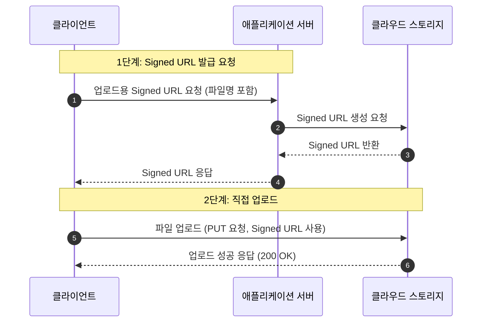
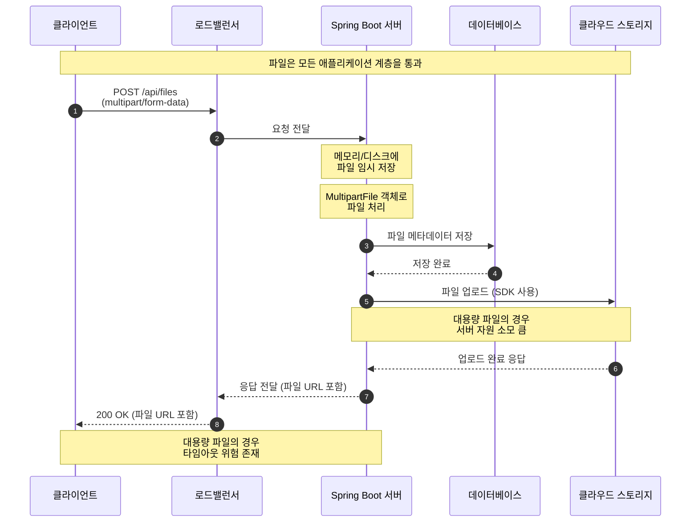
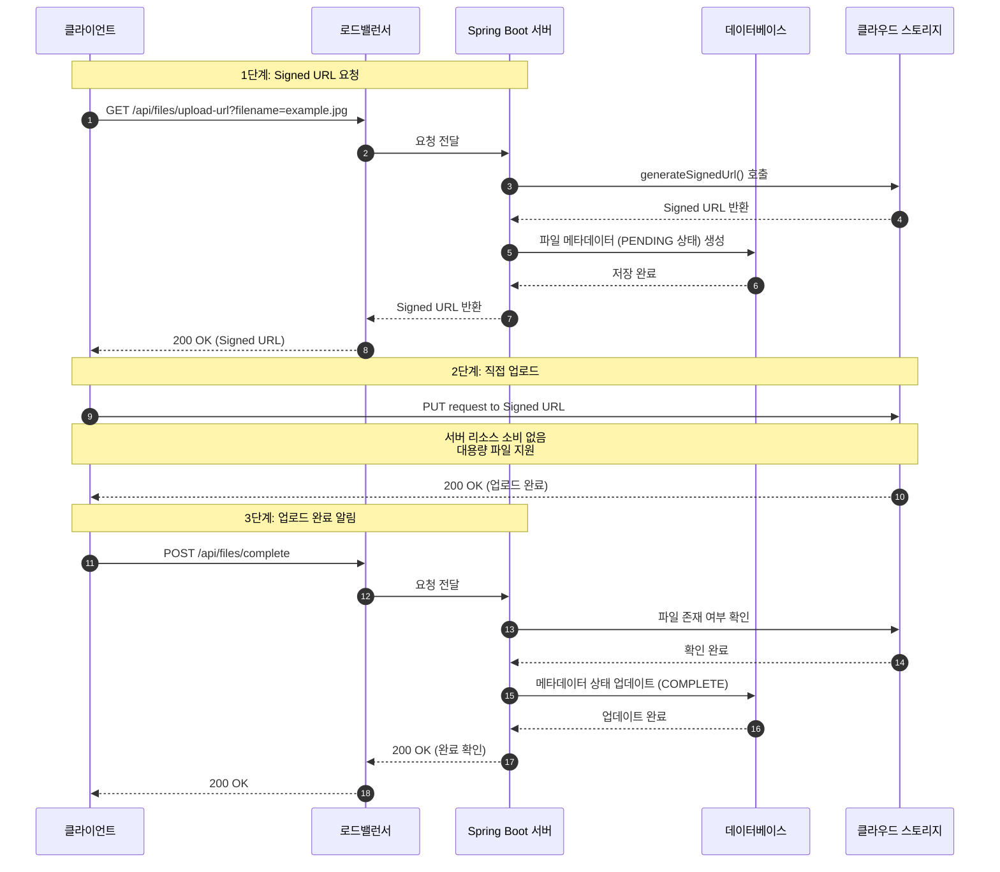

## Signed URL의 개념

Signed URL은 **리소스에 대해 일시적이고 제한된 접근 권한을 부여**하는 URL이다.  URL에는 클라우드 업체마다 다르지만, 보통 다음의 정보들을 포함하고 있다.

- 특정 스토리지 위치에 대한 경로
- 제한된 유효 시간
- 허용된 HTTP 메서드
- 인증 서명

이러한 정보들은 쿼리 파라미터 형태로 URL에 포함된다.

예를 들어, [Google Cloud의 Signed URL의 형태](https://cloud.google.com/storage/docs/access-control/signed-urls?hl=ko#example)는 다음과 같다.

```
https://storage.googleapis.com/example-bucket/cat.jpeg?X-Goog-Algorithm=
GOOG4-RSA-SHA256&X-Goog-Credential=example%40example-project.iam.gserviceaccount.com
%2F20181026%2Fus-central1%2Fstorage%2Fgoog4_request&X-Goog-Date=20181026T18
1309Z&X-Goog-Expires=900&X-Goog-SignedHeaders=host&X-Goog-Signature=247a2aa45f16
9edf4d187d54e7cc46e4731b1e6273242c4f4c39a1d2507a0e58706e25e3a85a7dbb891d62afa849
6def8e260c1db863d9ace85ff0a184b894b117fe46d1225c82f2aa19efd52cf21d3e2022b3b868dc
c1aca2741951ed5bf3bb25a34f5e9316a2841e8ff4c530b22ceaa1c5ce09c7cbb5732631510c2058
0e61723f5594de3aea497f195456a2ff2bdd0d13bad47289d8611b6f9cfeef0c46c91a455b94e90a
66924f722292d21e24d31dcfb38ce0c0f353ffa5a9756fc2a9f2b40bc2113206a81e324fc4fd6823
a29163fa845c8ae7eca1fcf6e5bb48b3200983c56c5ca81fffb151cca7402beddfc4a76b13344703
2ea7abedc098d2eb14a7
```

스토리지 경로 (`https://storage.googleapis.com/example-bucket/cat.jpeg`), 서명을 생성한 알고리즘 (`X-Goog-Algorithm`), 사용자 인증 정보(`X-Goog-Credential`), 요청 시간 (`X-Goog-Date`), 유효 기간 (`X-Goog-Expires`), 서명된 헤더 (`X-Goog-SignedHeaders`), 서명 (`X-Goog-Signature`)등의 인증 정보들이 URL의 쿼리 파라미터에 포함되어 있는 것을 확인할 수 있다.

## 작동 방식



1. 클라이언트에게 Signed URL 발급을 요청한다.
2. 요청자의 인증 정보와 서명 알고리즘을 이용해 서버 측에서 해시 기반 서명을 생성한다.
3. 2.에서 만든 서명 정보를 담아 URL을 클라이언트에게 발급한다.
4. 클라이언트는 발급된 URL을 통해 리소스에 접근한다.
    - 서버는 해당 URL에 포함된 서명을 통해 이를 검증한다.

## Signed URL을 사용하면 장점

signed url을 사용하면 클라이언트가 **서버를 거치지 않고 클라우드 스토리지에 직접 파일을 업로드하거나 다운로드** 할 수 있다.

기존 방식에서는 서버가 클라이언트로부터 파일을 수신한 뒤 클라우드에 업로드해야 하므로, **서버가 대용량 파일 트래픽을 직접 감당해야 하는 단점**이 있었다.

반면, Signed URL을 사용하면 클라이언트가 **서버를 거치지 않고 클라우드에 직접 업로드** 할 수 있어 **애플리케이션 서버의 부하를 효과적으로 줄일 수 있다.**

:::note
특히나 Spring Boot로 애플리케이션을 개발하는 입장에서, 파일 업로드의 경우 임시 파일을 생성한다거나 관련 디렉토리에 대한 메모리 문제가 발생하는 등 개발자가 처리하기 다소 번거로운 부분이 있다. Signed URL 방식을 사용하면 **서버가 파일 자체를 처리하지 않기 때문에**, 이러한 복잡한 처리를 클라우드 스토리지로 위임할 수 있다.
:::

### 기존의 파일 업로드 방식과 Signed URL 방식의 비교

- 기존 방식 (서버 중계 업로드)



- signed url 방식



## 주요 클라우드 제공업체별 Signed URL 서비스

| 제공업체 | 서비스명 | Signed URL 관련 기능 |
| --- | --- | --- |
| Google Cloud | Cloud Storage | Signed URLs, Signed Policy Documents |
| AWS | S3 | Pre-signed URLs, Pre-signed POST policies |
| Microsoft Azure | Blob Storage | SAS(Shared Access Signatures) |
| Naver Cloud | Object Storage | Pre-signed URLs |
| Oracle Cloud | Object Storage | Pre-Authenticated Requests |
| IBM Cloud | Cloud Object Storage | Presigned URLs |

## 참고 자료

- <https://cloud.google.com/storage/docs/access-control/signed-urls?hl=ko>
- <https://docs.aws.amazon.com/AmazonS3/latest/userguide/using-presigned-url.html>
- <https://stackoverflow.com/questions/20862195/what-is-difference-between-pre-signed-url-and-signed-url>
- <https://docs.aws.amazon.com/ko_kr/AmazonS3/latest/userguide/using-presigned-url.html>
- <https://dev.to/karthikeyantv/how-the-signed-url-works-2dbm>
