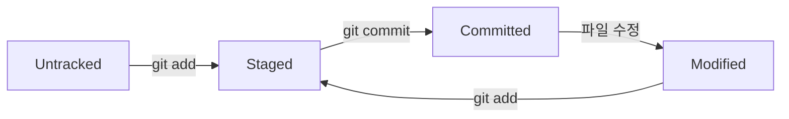
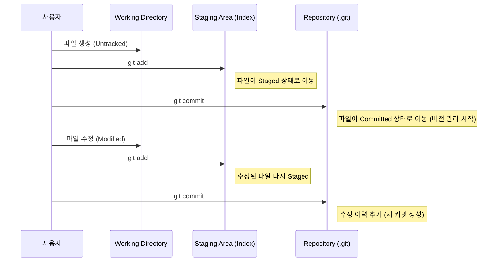
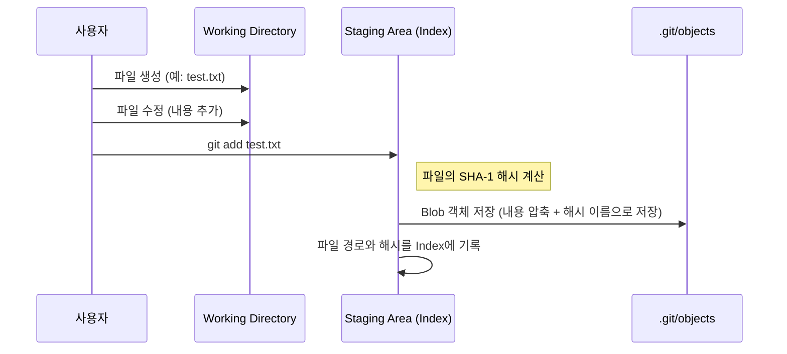

## 개요

Git 명령어 (`init` → `add` → `commit` → `checkout` → `merge`) 를 따라가면서 Git 내부 구조가 어떻게 변하는지 이해해본다.

`.git` 내부의 파일을 파싱하기 위해서는 다음의 파서를 활용한다.

::github{repo="charsyam/git-parser"}

## Git의 기본 구조

우선 Git은 기본적으로 **작업 내용의 버전을 관리 하는 시스템**이다. 즉, **작업하고 있는 현재 상태를 저장하는 것을 목표로 한다**고 생각해보자. 그렇다면 버전 관리 시스템에서는 무엇을 관리해야할까? 현재 작업 디렉터리의 구조와 파일의 변화 상태일 것이다.

리눅스 시스템을 생각해보면 디렉터리 역시 특수한 파일의 일종이라고 생각할 수 있다. 따라서 초점을 맞춰야하는 부분은 **“Git에서 파일을 어떻게 관리하느냐?”** 가 될 것이다.

따라서 우선은 Git에서 파일을 관리하기 위한 개념들을 살펴보자.

### Git에서 관리하는 파일의 상태

Git에서는 파일의 상태를 `Untracked` , `Modified`, `Staged`, `Committed` 로 나누어서 관리한다.

- `Untracked` : git에서 추적하지 않는 파일이다. 즉, Git은 해당 파일에 대해 알지 못한다.
- `Modified` : git에서 추적하는 파일 중, 파일의 내용이 변경된 경우를 의미한다.
- `Staged`: `git add` 명령을 통해 staging area에 올라간 파일을 의미한다. 이 말은 사용자가 변경 이력을 중간 저장한 내용을 의미한다.
- `Committed` : `staged` 한 내용을 버전 관리 시스템 (local repository라고 부른다) 에 반영하였음을 의미한다. `commit` 이 이루어지면 해당 버전의 파일 정보를 사용할 수 있다.

파일의 상태 변화 흐름을 그림으로 나타내면 아래와 같다.

### Git의 기본 공간

Git은 이러한 파일을 관리하기 위해, 파일의 데이터를 논리적인 공간을 이동시키는 방식으로 사용한다.

Git의 기본 공간은 다음과 같이 나눌 수 있다.

- **Working Directory**: 실제 파일이 있는 곳 (git과 독립적인 사용자의 현재 작업 공간)
- **Staging Area (Index)**: 커밋할 파일을 준비해두는 공간
- **Repository (.git 디렉토리)**: 파일의 버전 데이터(와 그외 필요한 정보)를 저장하는 공간

### 각 상태의 변화

따라서 Git에서 관리되는 파일의 상태가 변화되는 과정은 **각 파일의 상태를 Git의 기본 공간의 상호 작용을 통해 변경 시키는 과정**으로 정리할 수 있다.
이 과정을 대략적인 시퀀스 다이어그램으로 나타내면 다음과 같다.

## 명령어 흐름 따라가기

### Git Init

먼저 `git init` 은 현재 작업 공간 (Working Directory) 에서 Git을 통한 버전 관리 시스템을 시작하는 명령어이다. 따라서 작업 공간에 위에서 언급한 Staging Area와 Repository를 관리할 수 있어야 한다.

git에서는 이러한 관리를 `.git` 폴더를 이용하여 수행한다.

정리하면 `git init` 이란 현재 작업 공간이 `.git` 폴더를 초기화 하는 과정이라고 생각할 수 있다.

실제 코드를 보면서 확인해 보자.

`git init` 명령을 실행하고, `ls -al` 을 통해 현재 작업 디렉터리의 형태를 확인하면 다음과 같다.

현재 작업 디렉토리에 `.git` 디렉터리가 생겼음을 확인할 수 있다.

그리고 `.git` 의 내용을 확인해보면 다음과 같다.

### git add

`git add` 명령은 현재 파일을 staging area 에 올리는 명령이다.

Git에서는 staging area 를 `.git/index` 에서 관리한다.

파일을 생성하고 `git status` 를 통해, 확인해보면 현재 파일의 상태는 `untracked` 이다.

이제 `git add test.txt` 를 통해 현재 파일을 `staged` 상태로 만들어보자.

`git add` 를 실행한 후, `.git` 폴더를 보면 `.git/index` 파일이 생겼음을 확인할 수 있다.

이 `index` 파일을 파싱해서 확인하면 다음과 같은 내용을 담고 있다. (`.gitignore` 의 경우, `test.txt` 이전에 커밋해둔 파일)

> parser에서 각 entry 는 `mode` , `hash 값`, `파일 크기`, `파일 경로` 를 의미한다.
저 `mode` 의 경우, 리눅스 파일 저장 시스템의 `inode` 의 `mode` 값을 생각하면 되는데,
간단하게 `100644` 는 `100(일반 파일을 의미)` + `644(권한: rw-r--r--)` 을 의미한다고 생각하면 된다
>

여기서 주목해야 할 값은 `hash` 값이다. Git의 Staging Area (index) 는 **파일을 관리할 때 hash 값을 이용한다.**

그렇다면 해당 hash 값은 어떻게 활용될까? 이는 `.github/objects` 에서 확인할 수 있다.

`.github/objects` 를 확인해보면

위의 `test.txt` 의 해시값의 앞 두글자 `25` 로 시작하는 폴더가 생성되었고 뒤의 값을 제목으로 한 **오브젝트 파일** 이 생성되었음을 확인할 수 있다.

해당 오브젝트 파일을 확인하기 위해 파싱하여 내용을 확인해보면 다음과 같다.

즉 `.git` 에서 파일을 관리하기 위해, 이 파일을 `object` 라는 개념을 관리하게 되는데 일반 파일의 경우 `blob` 이라는 형태의 오브젝트로 저장하며, 오브젝트 파일은 파일의 내용이 압축되어 들어가있고 이 파일의 인덱스를 관리하기 위해 해시를 이용한다 라고 정리할 수 있다!

따라서 정리하면 `.git/index` 는 현재 추적할 파일의 파일 경로 이름과 파일의 오브젝트 파일에 대응되는 해시값이 저장되어있으며 `git add` 는 “해당 파일의 변경 정보를 staging area (index)에 올리는 과정” 이라고 정리할 수 있다.

이 동작을 시퀀스 다이어그램으로 나타내면 다음과 같다.

## git commit

이제 `git commit` 을 실행해보자.

메시지에서 `[main 1d7d10f]`  를 확인할 수 있는데, 위의 과정 처럼 해시값과 오브젝트 객체가 생겼음을 예상할 수 있다.

따라서 커밋을 통해 생긴 오브젝트 객체를 확인해보자. 위의 과정과 마찬가지로 `objects/1d/남은해시값` 의 파일에서 확인할 수 있다.

**커밋으로 생긴 오브젝트 객체**를 파싱해서 확인해보면 다음과 같다.

하나의 커밋을 나타내는 **커밋 오브젝트 객체** 는 `tree`, `parent` 그리고 커밋 관련 정보 (`author`, `comitter`, `commit message`) 로 구성되어 있음을 확인할 수 있다.

그렇다면 각각의 오브젝트 객체를 확인해보자.

먼저 `tree` 를 확인해보면

각 파일의 정보가 저장되어 있는 object 객체들을 저장함을 알 수 있다.

따라서 commit 객체의 `tree` 오브젝트는 **커밋 시점에서 기준 디렉터리의 파일 구성 상태** 를 나타낸다고 볼 수 있다.

cf) `tree` 객체가 나타내는 것

`tree` 객체는 리눅스 파일 시스템의 구조 처럼, 파일 시스템(디렉터리 구조)를 트리 형태로 추상화한 것이라고 생각할 수 있다.

예를 들어, 디렉터리를 새로 만들고 그 안의 파일을 만들어 그 내용을 add 해보자.

해시값에 대응하는 오브젝트를 확인해보면

이렇게 디렉터리를 나타내는 `tree` 객체가 만들어졌고, 그 객체 내부에 해당 디렉터리가 포함하고 있는 파일 object 객체를 가지고 있음을 확인할 수 있다.

그리고 `parent` 객체를 확인해보면

이전 시점의 커밋 객체임을 확인할 수 있다.

이를 정리하면 하나의 커밋 객체에 담기는 내용은 **commit 과 관련된 메타데이터 + 커밋 시점의 파일 시스템을 추상화 한 tree 객체 + 이전 커밋 객체** 이다.

즉, `git commit` 이란 현재 작업 이력의 내용의 스냅샷을 커밋 객체의 형태로 기록하는 과정이라고 요약할 수 있다.

### git checkout -b feature/test1

새로운 브랜치를 만들어보자. `git checkout -b feature/test1` 명령을 통해
 `feature/test1` 브랜치를 만들고 checkout 한 후 `.git/head` 의 내용을 확인해보면 다음과 같다.

즉, 브랜치의 정보는 `.git/heads` 폴더에 **해당 브랜치의 이름을 가진 폴더** 로 저장된다.

`git log` 를 통해 그래프를 확인해보면 다음과 같다.

위의 그래프에서 `(HEAD -> main, feature/test1) feature commit` 은 다음을 의미한다.

- 현재 사용자가 바라보고 있는 브랜치는 `main` 이다. (`HEAD`)
- 각 브랜치가 바라보고 있는 스냅샷은 `087041e (feature commit)` 이다.

그렇다면 각 `branch` 를 옮겨다닌다는 것의 의미는 다음과 같이 정리할 수 있다.

- `HEAD` 포인터를 옮기고자 하는 브랜치로 변경
- 각 브랜치는 특정 커밋을 가리키고 있으며, 해당 커밋은 **커밋되는 시점의 스냅샷**을 가지고 있으므로, 해당 스냅샷을 통한 환경에서 작업

### git merge

`git merge` 를 통해 `feature/test1` 과 `main` 을 머지해보자.

우선 **새로운 커밋이 만들어지지 않는 경우를 생각해보자.**

단순히 파일에 내용을 추가하고 `feature/test1` 브랜치에 새로운 커밋 `feature commit 2` 를 생성해보자. `git log` 를 통해 커밋 이력을 확인해보면 다음과 같다.

여기서 **충돌이 발생하지 않는다**는 `main` 브랜치의 내용과 `feature/test1` 의 내용을 합쳐도 아무런 문제가 생기지 않는다는 것을 의미한다.

그렇다면 `main` 과 `feature/test1` 을 같은 상태로 합치려면 어떻게 해야할까? 단순히 `main` 브랜치의 작업 상태를 더욱 최근에 만들어진 `feature/test1` 의 작업 상태로 변경하면 된다.

이렇게 브랜치 간 내용이 충돌 없이 이어질 때, 포인터만을 이동시켜 머지하는 방식을 `fast-forward` 라고 한다.

이를 그림으로 나타내면 다음과 같다.

따라서, `git merge` 가 일어나는 과정은 git 에서 관리되는 커밋 객체들의 그래프에 대해 브랜치로 대표되는 포인터를 옮겨가는 과정이라고 생각할 수 있다.

**새로운 커밋이 만들어지는 경우를 생각해보자.** `main` 과 `feature` 에서 독립적으로 커밋을 추가하고, 충돌이 발생하는 경우를 가정해보자.

main 과 feature 에서 `test.txt` 의 같은 부분을 서로 다르게 수정하고 commit 한 후, 커밋 그래프를 확인해보면 다음과 같다.

이 후 main 과 feature 를 merge 해보자.

CLI 에서 충돌이 발생하므로, 직접 해결함을 요구한다.

충돌이 발생한 파일을 확인해보면 다음과 같다.

이를 해결한 후, 커밋하면 merge 를 위한 commit 이 새로 생겼음을 확인할 수 있다.

해당 merge commit 을 통해 생성되는 커밋 객체를 확인해보면 다음과 같다.

각 커밋의 부모가 merge 되고자 하는 브랜치가 가리키는 커밋 객체이므로 두 개의 부모를 가진다.

해당 작업을 그림으로 나타내면 다음과 같다.

- merge 이전

    

- merge 이후

    

## 결론

Git의 내부 동작을 통해 각 명령어를 요약하면 다음과 같다.

- `git init` : 현재 작업디렉토리를 git 을 이용해 관리하기 위해 `.git` 을 셋업하는 과정
- `git add` : 파일의 내용을 `.git` 의 오브젝트로 저장하고, 해시값과 파일을 연결해 staging area (git index) 로 옮기는 과정
- `git commit` : 현재 작업의 스냅샷을 이전 버전 + 현재 작업 디렉터리의 구조 + 커밋 메타데이터의 형태의 커밋 객체를 만드는 과정
- `git checkout -b feature` : 특정 커밋을 가리키는 `feature` 포인터를 만들고 커밋 객체의 내용을 통해 스냅샷을 불러오는 과정
- `git merge` : 서로 다른 커밋 이력을 가진 브랜치를 합치기 위해, 포인터를 이동하거나(빠른 병합) 새로운 병합 커밋을 생성하여 커밋 그래프를 잇는 과정

따라서 git은 결국 **커밋 스냅샷과 브랜치 포인터 이동을 다루는 방식으로 버전을 관리하는 시스템**이라고 요약할 수 있다.
