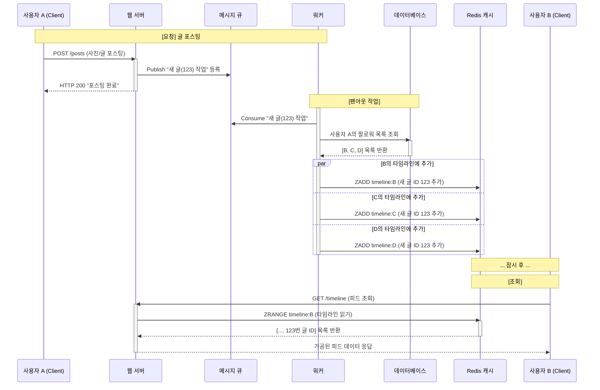
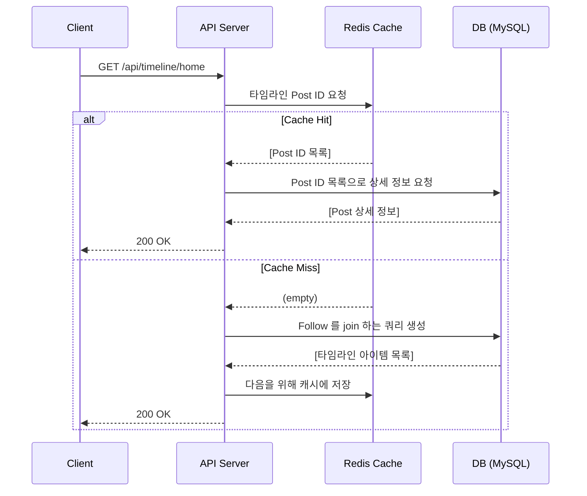
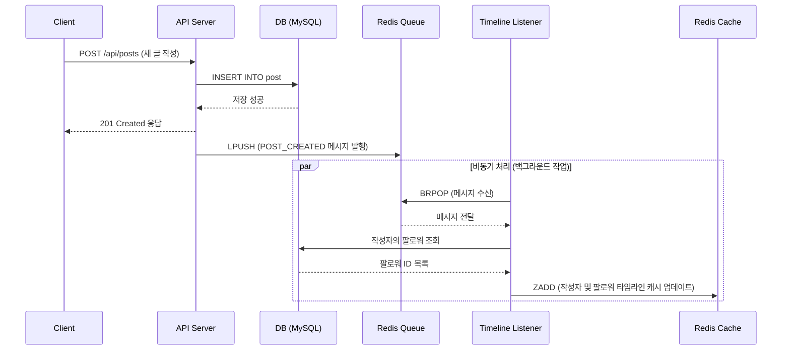

## 개요

이전 글에서 홈 타임라인 조회 API의 성능 병목을 해결하기 위해 **타임라인을 조회할 때 마다 RDB에서 무거운 쿼리를 실행하는 비용을 줄이는 것**을 목표로 하였다.

이를 위해 **캐시**를 도입하고, 캐시의 업데이트 패턴으로는 Push 방식 (Fa**n-out on write) 방식**을 도입하였다.

이번 글에서는 **Push 방식 (Fan-out on write) 방식과 해당 방식을 통해 기존의 애플리케이션 구조를 재설계하고 사용하는 기술을 논한다.**

## 이전 방식의 문제점과 개선 방향

기존 방식(Pull 모델)에서는 현재 로그인한 사용자가 타임라인을 요청할 때 마다(읽기 시점) 서버는 팔로우하는 모든 사람의 게시물을 DB에서 동적으로 생성해야 했다.

 [이전 글](https://punchdrunkard.github.io/posts/project/2025-08-01-timline-fan-out-01/)에서 확인했듯이 복잡한 JOIN 연산과 OR 연산자로 인해 해당 쿼리는 아주 무거웠고, 실제로도 서버에 부하를 일으켰다.

이 문제를 해결하기 위해 Fan-out 을 도입해보자. 즉, 사용자가 타임라인을 요청하기 전에 **미리 각 사용자의 타임라인을 만들어 두는 것**이다. 복잡한 `JOIN`과 필터링 연산들을 글 작성 시점에 미리 해두어 각 사용자의 타임라인을 캐시에 만들어두고, 사용자는 쿼리를 실행하지 않고 미리 계산된 자신의 타임라인 목록만 읽어가는 방식으로 개선하는 것이 목표이다.  

## Fan-out on Write

팬 아웃은 **하나의 정보나 요청이 여러 개의 목적지로 동시에 혹은 순차적으로 퍼져나가 복제/전송되는 아키텍처 패턴**을 의미한다. 마치 부채(Fan)가 펼쳐지는 것 처럼 데이터가 한 지점에서 여러 지점으로 확산되는 것이다.

주로 **쓰기(Write) 시점에 더 많은 작업을 처리하여, 읽기(Read) 시점의 부하를 줄이고 속도를 높이는 데 목적**이 있다. 즉, **읽기 시점의 복잡한 연산을, 상대적으로 빈도가 낮은 쓰기 시점의 여러 작은 작업들로 분산시키는 것이다.** 나의 프로젝트는 사용자가 게시물을 작성하면(하나의 이벤트), 그를 팔로우하는 모든 사람(다수의 구독자)의 타임라인에 해당 게시물이 전달되어야 하며, 소셜 미디어의 특성상 READ 연산이 많이 발생하므로 해당 아키텍처가 적합하다고 생각하였다.

### Fan-out on Write의 기본 구조

 Fan-out on Write는 보통 **메시지 큐(Message Queue)와 캐시(Cache)를 조합**하여 구현한다.

기본적인 동작 방식은 다음과 같다.

1. **[요청]** 사용자 A가 포스팅을 한다.
2. **[처리]** 서버는 포스팅 요청을 받아 메시지 큐에 사용자가 새 글을 등록했다는 이벤트를 등록한다.
3. **[팬 아웃 작업]** 메시지 큐에 대기하고 있는 작업을 워커(Worker) 프로세스가 가져온다.
    - 해당 프로세스는 먼저 사용자 A의 팔로워 목록을 DB에서 조회한다.
    - 워커는 각 팔로워들의 개인 타임라인 캐시에 접근하여 새 글의 ID를 추가한다.
4. **[조회]** 사용자 A를 팔로우하고 있는 팔로워가 피드를 확인하면, 시스템은 팔로워의 타임라인 캐시를 바로 읽어 해당 글을 포함한 피드를 바로 보여준다.

## 프로젝트에서의 설계

### 시스템 구성 요소

프로젝트의 타임라인 조회 API에서도 기본적인 팬 아웃의 구조를 따른다.

이 때, 기술 선택의 경우 Message Queue와 Cache 용도로 Redis를 선택하였다. Redis의 경우 Persistence Layer에서 MQ나 Timeline을 구성하기 위한 다양한 자료구조를 지원하기 때문이다.

- **Timeline 캐시** (`Sorted Set`)
  - 각 사용자의 타임라인을 저장하기 위해 `Redis`의 `Sorted Set`을 선택하였다. 최신 순 정렬 뿐만 아니라 기존의 커서 기반 페이지네이션과의 통합이 필요했는데, Sorted Set 자료구조를 사용하면 커서의 정렬 기준을 통해 데이터의 일부를 빠르게 조회할 수 있기 때문이다.
- **Message Queue** (`List`)
  - 비동기 작업을 위한 큐로는 `Redis`의 `List` 자료구조와 `LPUSH`/`BRPOP` 명령어를 사용하였다. 왜냐하면 Kafka나 RabbitMQ 같은 전문 메시지 큐 시스템을 도입하는 것 보다 현재 프로젝트의 규모에서는 이미 사용하고 있는 Redis 인프라를 그대로 활용할 수 있기 때문이다.

시스템 구성도는 위와 같고, 각 구성요소들의 역할은 다음과 같다.

**App Server (Spring Boot)**

- API 엔드 포인트
- 이벤트 발행자 (Publisher) : 글 작성, 삭제, 팔로우 등의 상태 변경이 발생하는 경우, 비동기 처리를 위해 Redis Queue에 메시지를 발행한다.
- 백그라운드 리스너 (Consumer) : `TimelineQueueListener`를 통해 Redis Queue의 메시지를 구독하고, Fan-out 로직을 비동기적으로 수행
  - **즉, `TimelineQueueListener`가 동작하는 스레드가 Fan-out on Write 구조의 Worker 역할을 하게 된다.**

**Persistence Layer**

- **Redis (Cache & MQ)**
  - **타임라인 캐시 (Sorted Set)** : 각 사용자 별로 **캐시된 타임라인 (게시물 ID의 목록)** 을 저장, **Sorted Set의 자동 정렬 기능을 사용하여 최신순 유지**
  - **경량 메시지 큐 (List)** : 시간이 오래 걸리는 팬아웃 작업을 API 서버의 주 응답 경로에서 분리하기 위한 Buffer 역할
- **MySQL (RDB)**
  - 모든 원본 데이터 저장 (데이터의 영속성, 정합성, 안정성을 보장)

### 각 연산에 따른 동작

- `READ`

사용자가 타임라인을 요청하면 서버는 먼저 Redis 캐시에 저장된 해당 유저의 타임라인(게시물 ID목록)을 조회한다.

- Cache Hit : 서버는 캐시에서 가져온 게시물 ID 목록을 사용하여, DB에서 실제 게시물의 상세 정보를 가져와 조합한 후 사용자에게 반환한다.
- Cache Miss : 데이터가 없다면 기존 방식대로 DB에서 직접 JOIN을 실행하여 타임라인을 생성한다. 그리고 다음 요청을 위해 다시 캐시에 저장한 후 사용자에게 반환한다

즉, Cache 전략은 Cache-Aside 패턴을 사용한다.

- `WRITE`

1. 동기 처리 : 사용자가 새 글 작성을 요청하면, 서버는 우선 DB에 게시물을 저장한다. 저장이 성공하면 사용자에게 즉시 작성 완료 응답을 보낸다. 이 후, "새 글이 작성되었음" 이라는 메시지를 Redis Queue에 넣는다.
2. 비동기 처리 (Worker Thread) : 백그라운드에서 실행되는 `TimelineListener`가 큐에 들어간 메시지를 가져가 Fan-out 로직을 수행한다. 리스너는 DB에서 글 작성자의 팔로워 목록을 조회한 뒤, 각 팔로워의 타임라인 캐시에 새 게시물 ID를 추가하여 캐시를 업데이트합니다.

## 마무리

홈 타임라인 조회 API를 구현하기 위한 시스템 설계와 기술 선택 근거에 대해 작성하였다.

다음 글에서는 Spring Boot에서 Fan-out on Write 를 어떤 방식으로 구현하였는지에 대해 설명한다.

## 참고 자료

- <https://www.geeksforgeeks.org/system-design/pull-vs-push-api-architecture-system-design/>
